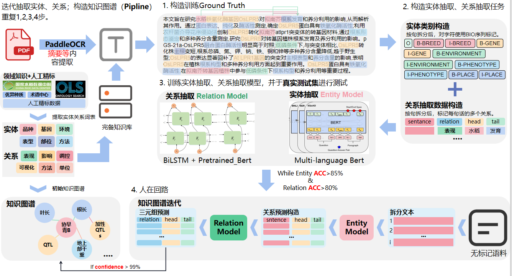

# 实体关系抽取：作物为中心的实体关系抽取识别模型CC-ERE

| 方法名称 | Crop-Centric Entity Relation Extraction Model                                                                                                                                                                                                                                                                                                                                      |
| :------: | :--------------------------------------------------------------------------------------------------------------------------------------------------------------------------------------------------------------------------------------------------------------------------------------------------------------------------------------------------------------------------------- |
| 开发语言 | Python                                                                                                                                                                                                                                                                                                                                                                             |
| 下载地址 | [Github](https://github.com/njustkmg/National-Key-RD-Program-of-China/tree/main)                                                                                                                                                                                                                                                                                                      |
| 方法描述 | 目前，基于农业农业科技文献数据构造的知识图谱一般使用格式化农业百科数据作为实体，而后与人工标注结合进行实体分类，与关系提取。尽管具备相对合理的层级化关系，但仍存在以下问题：1. 专家知识缺乏，农业百科的实体、关系分类方式难以获得可信赖的领域知识图谱。2. 领域数据缺乏，用于构建农业知识图谱的语料数据不足，难以获得全面的领域知识图谱。基于上述挑战，本项目在构建完备知识库后采用 |

　　‍

## 作物为中心的实体关系抽取识别模型框架图



## 环境配置

```python
torch>=1.5,<=1.11
hydra-core==1.0.6
tensorboard==2.4.1
matplotlib==3.4.1
transformers==4.26.0
jieba==0.42.1
scikit-learn==0.24.1
seqeval==1.2.2
opt-einsum==3.3.0
wandb==0.12.7
ujson==5.6.0
huggingface_hub==0.11.0
tensorboardX==2.5.1
nltk==3.8
protobuf==3.20.1
numpy==1.21.0
ipdb==0.13.11
pytorch-crf==0.7.2
tqdm==4.66.1
openai==0.28.0
Jinja2==3.1.2
datasets==2.13.2
pyhocon==0.3.60
```

## 模型权重下载

```python
# 链接：https://pan.baidu.com/s/1hXvNk95FwASD4XSZP14YOA 提取码：buhe

# ner.zip 放入 /ner 目录下
# re.zip 放入 /
```

## 预测步骤

```python
# 实体抽取预测
python /knowledge/ner/predict.py
# 关系抽取预测
```

## Reference

　　[DeepKE](https://github.com/zjunlp/DeepKE)
