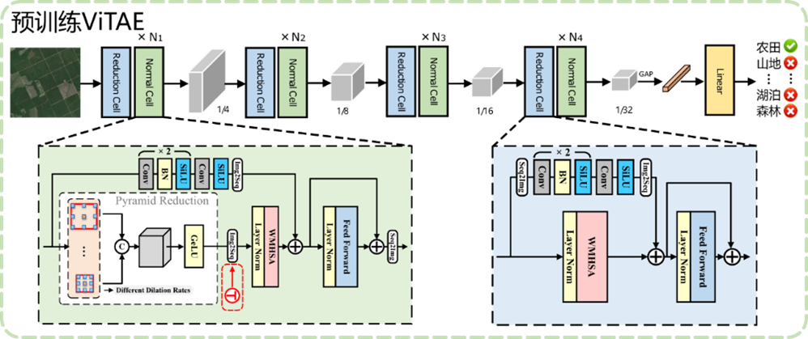

# ViTAE

| **方法名称**      | 多场景农业视觉基础模型                                                                                                                                                              |
| ----------------- |--------------------------------------------------------------------------------------------------------------------------------------------------------------------------|
| 类别              | 自监督预训练模型                                                                                                                                                                 |
| 开发语言          | Python 3.6                                                                                                                                                               |
| 运行平台/操作系统 | Windows                                                                                                                                                                  |
| 编译工具及环境    | Pycharm                                                                                                                                                                  |
| Github 下载地址   | [链接](https://github.com/njustkmg/National-Key-RD-Program-of-China/tree/main/ViTAE-main)                                                                                  |
| 方法描述          | ViTAE引入了CNN中固有归纳偏置（局部性和平移不变性），能够更好地聚合局部和全局信息；此外，ViTAE在下采样之后会堆叠Normal Cell模块，可以一定程度上补偿空间细节丢失，尤其在分割任务上具有一定优势。基于此，本项目采用ViTAE作为多场景农业视觉基础模型，并在微调阶段引入类别感知编码模块，以显式区分不同场景下的农业图像。 |

## 方法

### 多场景农业视觉基础模型的预训练框架图




## 所需环境
- Python 3.6
- PyTorch 1.2.0

## 文件下载
训练所需的预训练权重都可以在百度云下载。     
链接: https://pan.baidu.com/s/18Ze7YMvM5GpbTlekYO8bcA     
提取码: 5wym   

## 训练步骤（以分类任务为例）
1. datasets文件夹下存放的图片分为两部分，train里面是训练图片，test里面是测试图片。  
2. 在训练之前需要首先准备好数据集，在train或者test文件里里面创建不同的文件夹，每个文件夹的名称为对应的类别名称，文件夹下面的图片为这个类的图片。文件格式可参考如下：
```
|-datasets
    |-train
        |-Maize
            |-123.jpg
            |-234.jpg
        |-Rice
            |-345.jpg
            |-456.jpg
        |-...
    |-test
        |-Maize
            |-567.jpg
            |-678.jpg
        |-Rice
            |-789.jpg
            |-890.jpg
        |-...
```
3. 在准备好数据集后，需要在根目录运行txt_annotation.py生成训练所需的cls_train.txt，运行前需要修改其中的classes，将其修改成自己需要分的类。   
4. 之后修改model_data文件夹下的cls_classes.txt，使其也对应自己需要分的类。  
5. 在train.py里面调整自己要选择的网络和权重后，就可以开始训练了。  

## 预测步骤
### 使用自己训练的权重
1. 按照训练步骤训练。  
2. 在classification.py文件里面，在如下部分修改model_path、classes_path、backbone使其对应训练好的文件；model_path对应logs文件夹下面的权值文件，classes_path是model_path对应分的类，backbone对应使用的主干特征提取网络。  
 ```python
_defaults = {
    #--------------------------------------------------------------------------#
    #   使用自己训练好的模型进行预测一定要修改model_path和classes_path！
    #   model_path指向logs文件夹下的权值文件，classes_path指向model_data下的txt
    #   如果出现shape不匹配，同时要注意训练时的model_path和classes_path参数的修改
    #--------------------------------------------------------------------------#
    "model_path"    : 'model_data/best_epoch_weights.pth',
    "classes_path"  : 'model_data/cls_classes.txt',
    #--------------------------------------------------------------------#
    #   输入的图片大小
    #--------------------------------------------------------------------#
    "input_shape"   : [224, 224],
    #--------------------------------------------------------------------#
    #   所用模型种类：
    #--------------------------------------------------------------------#
    "backbone"      : 'vitae-win',
    #-------------------------------#
    #   是否使用Cuda
    #   没有GPU可以设置成False
    #-------------------------------#
    "cuda"          : True
}
```
3. 运行predict.py，输入 
```python 
img/maize.jpg
```  

## 评估步骤
1. datasets文件夹下存放的图片分为两部分，train里面是训练图片，test里面是测试图片，在评估的时候，我们使用的是test文件夹里面的图片。  
2. 在评估之前需要首先准备好数据集，在train或者test文件里里面创建不同的文件夹，每个文件夹的名称为对应的类别名称，文件夹下面的图片为这个类的图片。
3. 在准备好数据集后，需要在根目录运行txt_annotation.py生成评估所需的cls_test.txt，运行前需要修改其中的classes，将其修改成自己需要分的类。 
4. 之后在classification.py文件里面修改如下部分model_path、classes_path、backbone使其对应训练好的文件；model_path对应logs文件夹下面的权值文件，classes_path是model_path对应分的类，backbone对应使用的主干特征提取网络。
5. 运行eval_top1.py和eval_top5.py来进行模型准确率评估。

## Reference
https://github.com/keras-team/keras-applications   